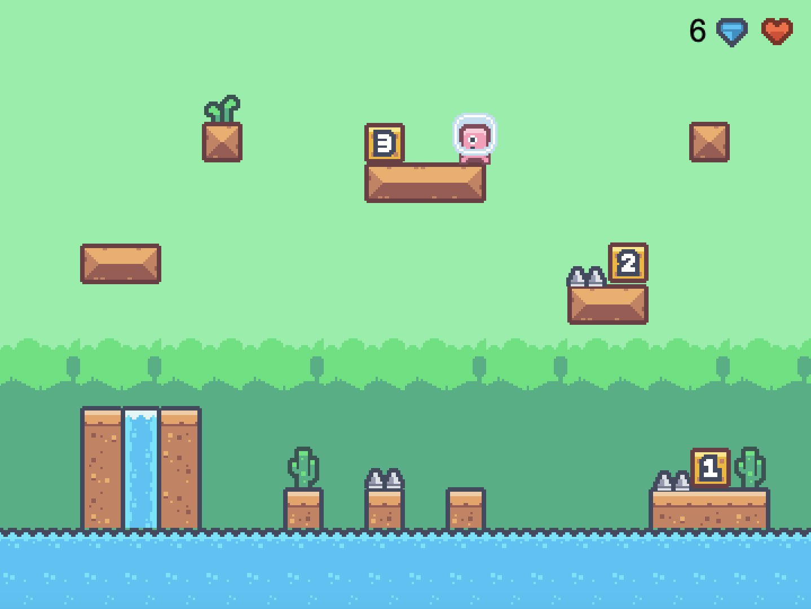
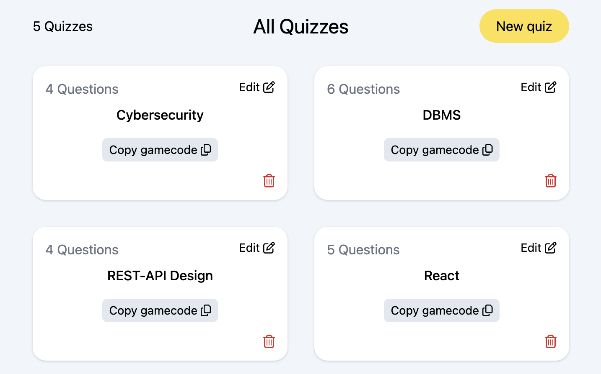

# Game Based Learning System

## Overview
This project is a game-based learning platform. Multiple-choice quizzes can be created via a dashboard and loaded into a game via a gamecode. The game is a 2D platformer game for a playful answering of multiple-choice-questions. This project was developed in the context of a master's thesis at Fernuni Hagen.

#### Game View

#### Quiz Configuration Dashboard

## Project Structure
- dashboard - Frontend interface for users to create multiple-choice quizzes
- game - Core game logic and assets for the educational game
- backend - API-Server

## Tech Stack

This project uses the following technologies:

- **Dashboard**: React.js, Tailwind CSS
- **Backend**: Node.js, Express.js, MongoDB
- **Game**: Phaser.js, JavaScript

## Installation
1. Clone this repository
2. Run `npm install` to install dependencies in the backend, dashboard and game folder respectively.
3. Backend Set-up:
    - Create a database in MongoDB with a collection named `quizzes`. You can use `schema.js` if you want the schema to be enforced by MongoDB.
    - Create the .env file based on the .env.example. Add values for the DB_URL and DB_NAME variables.

## Usage
- Start the Backend with `npm run start` and the dashboard and game with `npm run dev` in the respective folder.

## Game Assets
- Graphics: [Kenney Pixel Platformer](https://www.kenney.nl/assets/pixel-platformer)
- Music: Sound Effects: [Kenney Sci-fi Sounds](https://www.kenney.nl/assets/sci-fi-sounds), [Kenney Music Jingles](https://www.kenney.nl/assets/music-jingles)
, Background Music: [Ambiences Music Pack](https://jdsherbert.itch.io/ambiences-music-pack)

## License
This project is licensed under the **[CC BY-NC 4.0 License](https://creativecommons.org/licenses/by-nc/4.0/)**.